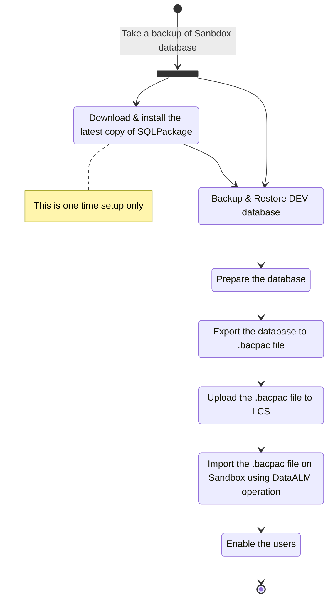

# Database movement from Tier 1 to Tier 2 (DEV to Sandbox)
Reference : [Golden configuration promotion](https://docs.microsoft.com/en-us/dynamics365/fin-ops-core/dev-itpro/database/dbmovement-scenario-exportuat)


## Step#1 (Download the latest copy of SQLPackage)
On the target environment:
- Use the Windows (.NET Framework)/DacFramework installer to install the the latest SQLPackage
 - [Download and run the DacFramework.msi installer for Windows](https://aka.ms/dacfx-msi)
- SqlPackage is installed to the ```C:\Program Files\Microsoft SQL Server\160\DAC\bin``` folder

## Step#2 Backup & Restore DEV database
1. Backup AxDB database
    
    
    
    - > [!NOTE] Change "Restore as" with new file names
      
      

## Step#3 (Prepare the database)
```sql
USE [AxDB_CopyForExport_06152022]
GO

update sysglobalconfiguration
set value = 'SQLAZURE'
where name = 'BACKENDDB'

update sysglobalconfiguration
set value = 1
where name = 'TEMPTABLEINAXDB'

drop procedure if exists XU_DisableEnableNonClusteredIndexes
drop procedure if exists SP_ConfigureTablesForChangeTracking
drop procedure if exists SP_ConfigureTablesForChangeTracking_V2
drop schema [NT AUTHORITY\NETWORK SERVICE]
drop user [NT AUTHORITY\NETWORK SERVICE]
drop user axdbadmin
drop user axdeployuser
drop user axmrruntimeuser
drop user axretaildatasyncuser
drop user axretailruntimeuser
drop user axdeployextuser

--Tidy up the batch server config from the previous environment
DELETE FROM SYSSERVERCONFIG

--Tidy up server sessions from the previous environment
DELETE FROM SYSSERVERSESSIONS

--Tidy up printers from the previous environment
DELETE FROM SYSCORPNETPRINTERS

--Tidy up client sessions from the previous environment
DELETE FROM SYSCLIENTSESSIONS

--Tidy up batch sessions from the previous environment
DELETE FROM BATCHSERVERCONFIG

--Tidy up batch server to batch group relation table
DELETE FROM BATCHSERVERGROUP

-- Clear encrypted hardware profile merchant properties
update dbo.RETAILHARDWAREPROFILE set SECUREMERCHANTPROPERTIES = null where SECUREMERCHANTPROPERTIES is not null
```

## Step#4 (Export the database to .bacpac file)
> [!NOTE] Open command prompt in administrator mode

Navigate to the SQLPackage folder
```Console
cd C:\Program Files\Microsoft SQL Server\160\DAC\bin
```

Extract the .bacpac file
```Console
SqlPackage.exe /a:export /ssn:localhost /sdn:<database to export> /tf:D:\Exportedbacpac\my.bacpac /p:CommandTimeout=1200 /p:VerifyFullTextDocumentTypesSupported=false
```
Example:
```Console
SqlPackage.exe /a:export /ssn:localhost /sdn:AxDB_CopyForExport_06152022 /tf:"D:\Backup\AxDB_moveToSAT.bacpac" /p:CommandTimeout=1200 /p:VerifyFullTextDocumentTypesSupported=false
```
> [!NOTE] This is a long running process (takes aboout 30-60 minutes or more depending on the database size)


  
## Step#5 (Upload the .bacpac file to LCS)

## Step#6 (Import the .bacpac file on Sandbox using DataALM operation)

  

  


## Step#7 (Enable the users)
