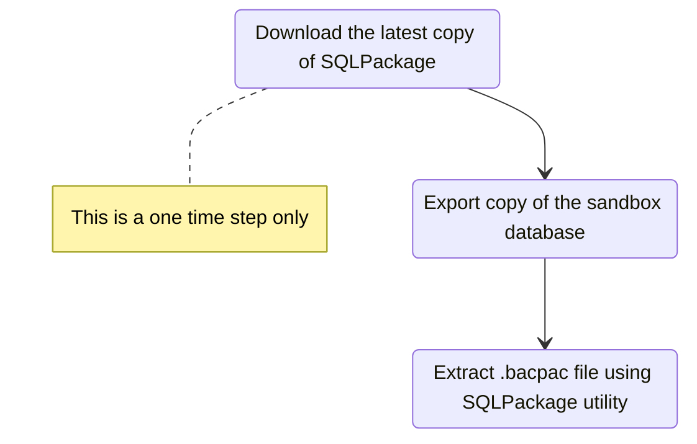

# Database movement from Tier 2 to Tier 1 (Sandbox to DEV)
Reference : [Export a copy of the standard user acceptance testing (UAT) database](https://docs.microsoft.com/en-us/dynamics365/fin-ops-core/dev-itpro/database/dbmovement-scenario-exportuat)



## Step#1 (Download the latest copy of SQLPackage)
- Use the Windows (.NET Framework)/DacFramework installer to install the the latest SQLPackage
 - [Download and run the DacFramework.msi installer for Windows](https://aka.ms/dacfx-msi)
- SqlPackage is installed to the ```C:\Program Files\Microsoft SQL Server\160\DAC\bin``` folder

## Step#2 (Export copy of the sandbox database)

     
> - [ ] By clicking Submit, you agree that Export Database will make the environment temporarily unavailable

## Step#3 (Extract .bacpac file using SQLPackage utility)
> [!NOTE] Open command prompt in administrator mode

Navigate to the SQLPackage folder
```Console
cd C:\Program Files\Microsoft SQL Server\160\DAC\bin
```

Extract the .bacpac file
```Console
SqlPackage.exe /a:import /sf:<Location for .bacpac file> /tsn:localhost /tdn:<target database name> /p:CommandTimeout=1200
```
Example:
```Console
SqlPackage.exe /a:import /sf:"D:\Backup\SATbackup.bacpac" /tsn:localhost /tdn:AxDB_copiedFromSandbox_06152022 /p:CommandTimeout=1200
```


## Step#4 (Update the imported database)

## Step#5 (Reprovision admin user)

## Step#6 (Swap the database)

## Step#7 (Synchronize the database)
