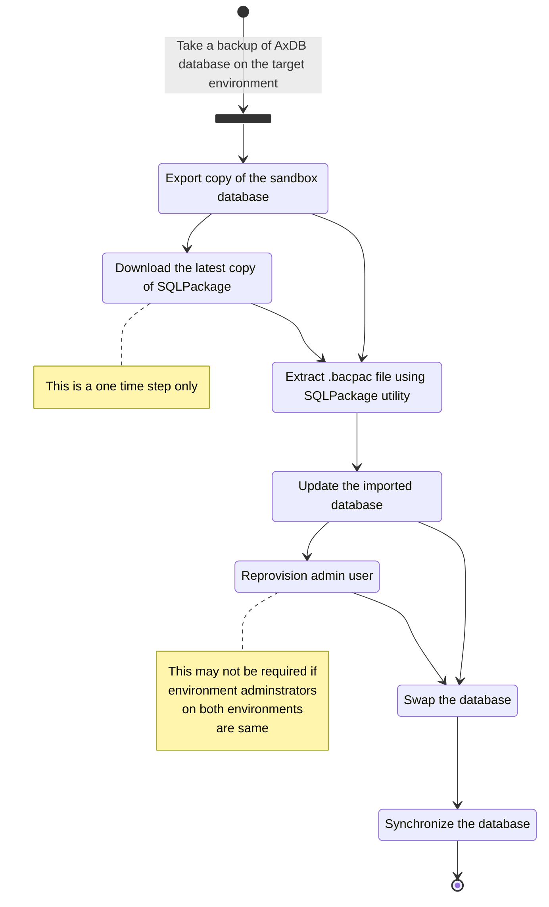

# Database movement from Tier 2 to Tier 1 (Sandbox to DEV)
Reference : [Export a copy of the standard user acceptance testing (UAT) database](https://docs.microsoft.com/en-us/dynamics365/fin-ops-core/dev-itpro/database/dbmovement-scenario-exportuat)


## Step#1 (Export copy of the sandbox database)

     
> - [ ] By clicking Submit, you agree that Export Database will make the environment temporarily unavailable

## Step#2 (Download the latest copy of SQLPackage)
On the target environment:
- Use the Windows (.NET Framework)/DacFramework installer to install the the latest SQLPackage
 - [Download and run the DacFramework.msi installer for Windows](https://aka.ms/dacfx-msi)
- SqlPackage is installed to the ```C:\Program Files\Microsoft SQL Server\160\DAC\bin``` folder

## Step#3 (Extract .bacpac file using SQLPackage utility)
> [!NOTE] Open command prompt in administrator mode

Navigate to the SQLPackage folder
```Console
cd C:\Program Files\Microsoft SQL Server\160\DAC\bin
```

Extract the .bacpac file
```Console
SqlPackage.exe /a:import /sf:<Location for .bacpac file> /tsn:localhost /tdn:<target database name> /p:CommandTimeout=1200
```
Example:
```Console
SqlPackage.exe /a:import /sf:"D:\Backup\SATbackup.bacpac" /tsn:localhost /tdn:AxDB_copiedFromSandbox_06152022 /p:CommandTimeout=1200
```
> [!NOTE] This is a long running process (takes aboout 30-60 minutes or more depending on the database size)


When the operation is completed successfully, it says “Successfully imported database”.


## Step#4 (Update the imported database)
```sql
USE [AxDB_copiedFromSandbox_06152022]
GO

CREATE USER axdeployuser FROM LOGIN axdeployuser
EXEC sp_addrolemember 'db_owner', 'axdeployuser'

CREATE USER axdbadmin FROM LOGIN axdbadmin
EXEC sp_addrolemember 'db_owner', 'axdbadmin'

CREATE USER axmrruntimeuser FROM LOGIN axmrruntimeuser
EXEC sp_addrolemember 'db_datareader', 'axmrruntimeuser'
EXEC sp_addrolemember 'db_datawriter', 'axmrruntimeuser'

/*
  Line 91, 94, 95, 98 may result in error if retail is not installed and it is fine
*/
CREATE USER axretaildatasyncuser FROM LOGIN axretaildatasyncuser
EXEC sp_addrolemember 'DataSyncUsersRole', 'axretaildatasyncuser'

CREATE USER axretailruntimeuser FROM LOGIN axretailruntimeuser
EXEC sp_addrolemember 'UsersRole', 'axretailruntimeuser'
EXEC sp_addrolemember 'ReportUsersRole', 'axretailruntimeuser'

CREATE USER axdeployextuser FROM LOGIN axdeployextuser
EXEC sp_addrolemember 'DeployExtensibilityRole', 'axdeployextuser'

CREATE USER [NT AUTHORITY\NETWORK SERVICE] FROM LOGIN [NT AUTHORITY\NETWORK SERVICE]
EXEC sp_addrolemember 'db_owner', 'NT AUTHORITY\NETWORK SERVICE'

UPDATE T1
SET T1.storageproviderid = 0
    , T1.accessinformation = ''
    , T1.modifiedby = 'Admin'
    , T1.modifieddatetime = getdate()
FROM docuvalue T1
WHERE T1.storageproviderid = 1 --Azure storage

DROP PROCEDURE IF EXISTS SP_ConfigureTablesForChangeTracking
DROP PROCEDURE IF EXISTS SP_ConfigureTablesForChangeTracking_V2
GO
-- Begin Refresh Retail FullText Catalogs
DECLARE @RFTXNAME NVARCHAR(MAX);
DECLARE @RFTXSQL NVARCHAR(MAX);
DECLARE retail_ftx CURSOR FOR
SELECT OBJECT_SCHEMA_NAME(object_id) + '.' + OBJECT_NAME(object_id) fullname FROM SYS.FULLTEXT_INDEXES
    WHERE FULLTEXT_CATALOG_ID = (SELECT TOP 1 FULLTEXT_CATALOG_ID FROM SYS.FULLTEXT_CATALOGS WHERE NAME = 'COMMERCEFULLTEXTCATALOG');
OPEN retail_ftx;
FETCH NEXT FROM retail_ftx INTO @RFTXNAME;

BEGIN TRY
    WHILE @@FETCH_STATUS = 0 
    BEGIN 
        PRINT 'Refreshing Full Text Index ' + @RFTXNAME;
        EXEC SP_FULLTEXT_TABLE @RFTXNAME, 'activate';
        SET @RFTXSQL = 'ALTER FULLTEXT INDEX ON ' + @RFTXNAME + ' START FULL POPULATION';
        EXEC SP_EXECUTESQL @RFTXSQL;
        FETCH NEXT FROM retail_ftx INTO @RFTXNAME;
    END
END TRY
BEGIN CATCH
    PRINT error_message()
END CATCH

CLOSE retail_ftx; 
DEALLOCATE retail_ftx; 
-- End Refresh Retail FullText Catalogs
```

Enable change tracking
```sql
ALTER DATABASE [AxDB_copiedFromSandbox_06152022] SET CHANGE_TRACKING = ON (CHANGE_RETENTION = 6 DAYS, AUTO_CLEANUP = ON);
```

## Step#5 (Reprovision admin user)
```sql
USE [master]
GO

DECLARE @SID NVARCHAR(124) 
DECLARE @NetworkAlias NVARCHAR(255)
SELECT 
	  @SID = [SID]
	 ,@NetworkAlias = NetworkAlias
FROM [AxDB].[dbo].[UserInfo] WHERE Id = 'Admin'

UPDATE [AxDB_copiedFromSandbox_06152022].[dbo].[UserInfo] SET
	 [SID] = @SID
	,NetworkAlias = @NetworkAlias
WHERE Id = 'Admin'
```
## Step#6 (Swap the database)
1. Stop the following services on the target environment
   - World Wide Web Publishing Service
   - Microsoft Dynamics 365 Unified Operations: Batch Management Service
   - Management Reporter 2012 Process Service

2. Run the following commands to perform the swap
```sql
USE [master]
GO

ALTER DATABASE [AxDB] SET SINGLE_USER WITH ROLLBACK IMMEDIATE
ALTER DATABASE [AxDB] MODIFY NAME = [AxDB_Orig]
ALTER DATABASE [AxDB_Orig] SET MULTI_USER WITH ROLLBACK IMMEDIATE
GO

ALTER DATABASE [AxDB_copiedFromSandbox_06152022] SET SINGLE_USER WITH ROLLBACK IMMEDIATE
ALTER DATABASE [AxDB_copiedFromSandbox_06152022] MODIFY NAME = [AxDB]
ALTER DATABASE [AxDB] SET MULTI_USER WITH ROLLBACK IMMEDIATE
GO
```

3. Restart the following services on the target environment
   - World Wide Web Publishing Service
   - Microsoft Dynamics 365 Unified Operations: Batch Management Service
   - Management Reporter 2012 Process Service

## Step#7 (Synchronize the database)
